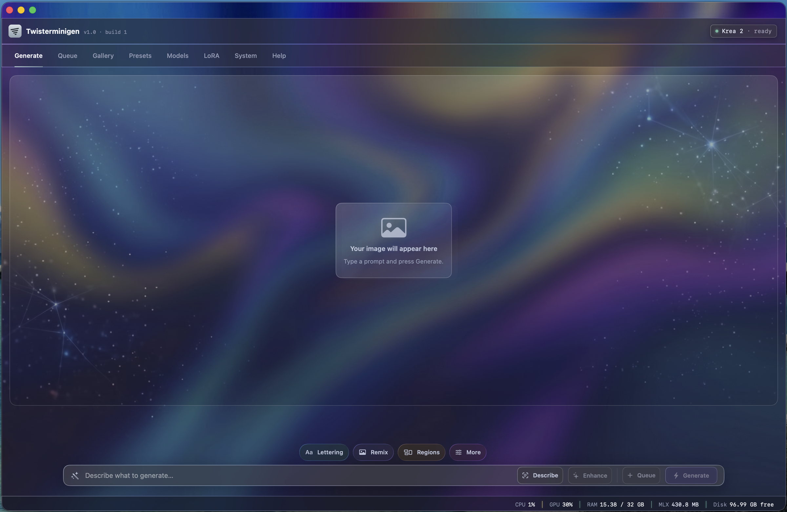
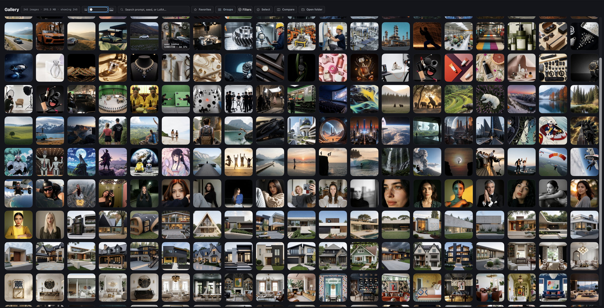
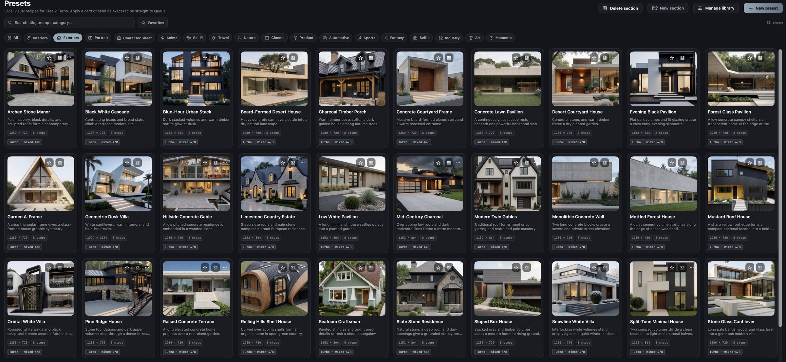
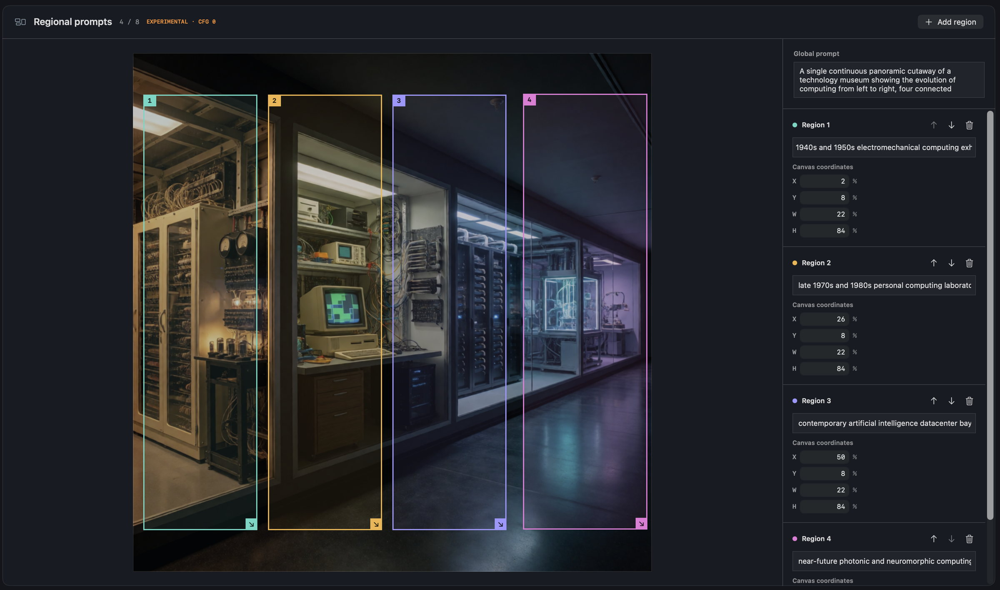
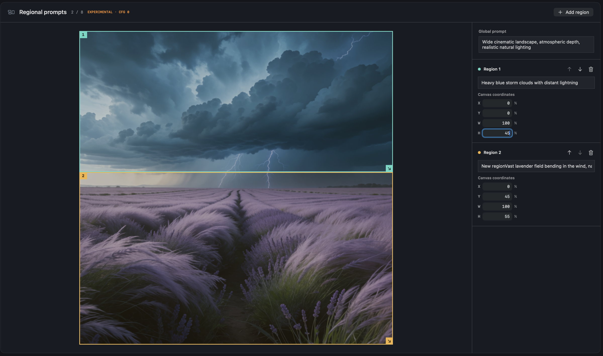
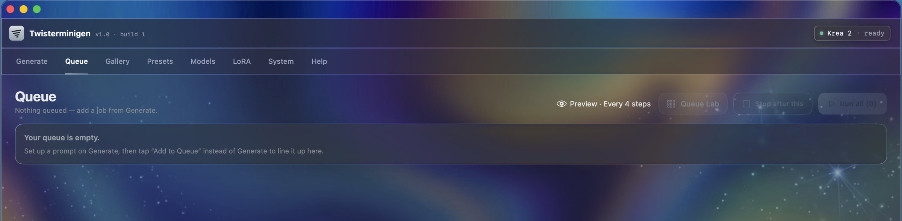
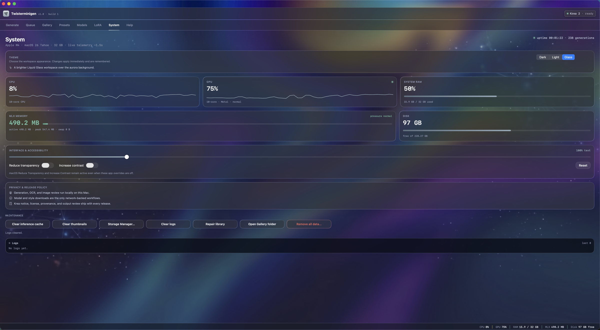
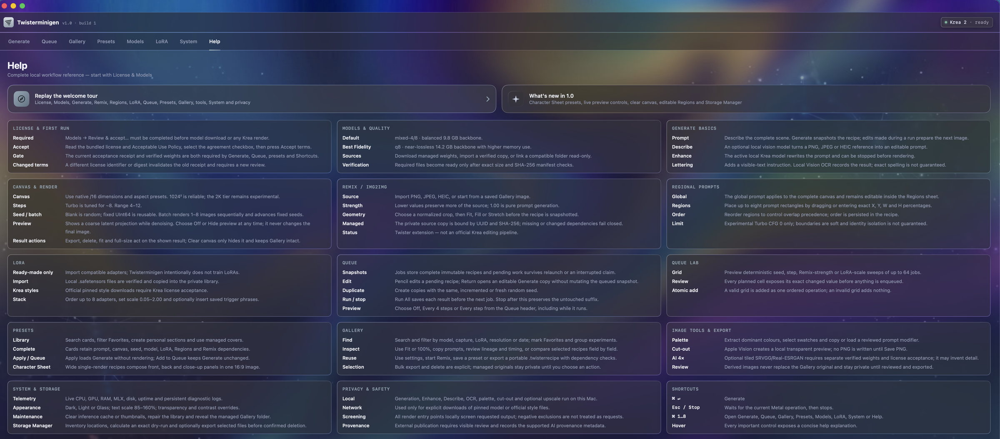

# Twisterminigen

[](https://github.com/abgitdev/Twisterminigen/actions/workflows/ci.yml)


[](https://github.com/abgitdev/Twisterminigen/pulls)

Twisterminigen is a native, local-first Krea 2 image-generation workspace for Apple Silicon,
implemented in Swift, SwiftUI, and MLX. It combines generation, Remix, regional prompting, LoRA,
queues, reusable presets, a searchable Gallery, local image tools, model management, and system
monitoring in one macOS application.

Prompts, source images, generated images, recipes, and Gallery metadata remain on the Mac unless
the user explicitly exports a file. Twisterminigen contains no advertising, analytics SDK, account
system, or telemetry upload.

Twisterminigen is an independent project. It is not an official Krea product and is not endorsed
by Krea.



## Contents

- [Highlights](#highlights)
- [Feature guide](#feature-guide)
- [Screenshots](#screenshots)
- [Requirements](#requirements)
- [Build from source](#build-from-source)
- [First run and model setup](#first-run-and-model-setup)
- [Storage and privacy](#storage-and-privacy)
- [Keyboard shortcuts](#keyboard-shortcuts)
- [Current limitations](#current-limitations)
- [Source release policy](#source-release-policy)
- [Support](#support)
- [Licenses](#licenses)

## Highlights

- Fully native SwiftUI interface with Dark, Light, and Glass themes.
- Local Krea 2 Turbo inference through Apple MLX on arm64.
- Default mixed-4/8 and Best Fidelity q8 model-quality tiers.
- Prompt generation, local prompt enhancement, and optional local image description.
- Remix/img2img with managed source images, crop controls, strength, Fit, Fill, and Stretch.
- Up to eight editable regional prompts with visual placement and deterministic recipe storage.
- Ordered LoRA stacks with scales, trigger phrases, and verified local imports.
- Persistent queue, queue editing, duplication, stop-after-current behavior, and experiment grids.
- Curated built-in presets plus personal presets, sections, favorites, and managed cover images.
- Searchable Gallery with favorites, lineage, recipe comparison, reusable settings, and bulk actions.
- Local palette extraction, Apple Vision cut-out, OCR review, and optional tiled 4× upscaling.
- Live CPU, GPU, unified-memory, MLX, disk, and uptime telemetry.
- Storage Manager with inventory, dry-run deletion plans, and explicit ownership checks.
- Local content-safety checks and review gates before external publication.

## Feature guide

### Generate

The Generate workspace is the main text-to-image surface.

- Write a positive prompt and an optional negative prompt.
- Choose a native `/16` canvas size or an aspect-ratio preset.
- Use 4–12 denoising steps; Krea 2 Turbo is tuned for approximately 8 steps.
- Enter a fixed `UInt64` seed for repeatability or leave it blank for a random seed.
- Render batches of 1–8 images. Fixed seeds advance deterministically across a batch.
- Show a coarse local preview every step, every four steps, or keep previews disabled.
- Export, delete, fit, inspect at full size, or clear only the visible canvas.

Prompt tools include:

- **Enhance** — rewrites the prompt with the active local Krea text model.
- **Describe** — uses an optional local vision model to turn PNG, JPEG, or HEIC input into an
  editable description.
- **Lettering** — adds visible-text guidance and records a local OCR review of the result.

### Remix / img2img

Remix starts from an imported image or a managed Gallery generation.

- Adjust strength to balance source preservation against prompt-driven changes.
- Select a normalized crop.
- Choose Fit, Fill, or Stretch geometry before the recipe is captured.
- Keep imported sources in a private managed library with UUID and SHA-256 integrity checks.
- Reopen Gallery generations with complete lineage instead of mutating the original.

Remix is a Twisterminigen extension and is not presented as an official Krea editing pipeline.

### Regional prompts

Regional prompting assigns different text to visual areas of one canvas.

- Place, resize, and reorder up to eight regions.
- Edit exact X, Y, width, and height percentages.
- Keep a global prompt for the complete image.
- Save region order and geometry in presets, queue jobs, and Gallery recipes.

Regional prompting is experimental and currently targets the Turbo CFG-0 workflow. Region
boundaries are soft; identity isolation is not guaranteed.

### Queue and Queue Lab

Queue jobs store complete immutable recipes and survive application relaunch.

- Edit pending jobs without changing already captured jobs.
- Duplicate with the same seed, an incremented seed, or a new random seed.
- Return a job to Generate as an editable copy.
- Run the full queue or stop after the current Metal operation completes.
- Preserve untouched jobs after a stop or interrupted claim.
- Choose the live-preview cadence while the queue is running.

Queue Lab can preview deterministic sweeps of seed, step count, Remix strength, or LoRA scale.
One reviewed grid can add up to 64 ordered jobs atomically.

### Presets

The preset library contains curated built-in recipes and user-created recipes.

- Search cards and filter favorites.
- Organize personal presets into sections.
- Store prompt, canvas, seed, model tier, LoRA stack, regions, and Remix dependencies.
- Apply a preset to Generate without rendering.
- Add a preset directly to Queue without changing the current Generate workspace.
- Use checked-in preset covers; preset resources are part of the clean source release.

### Gallery

Every successful render is stored with an immutable recipe and a private managed image.

- Search and filter by model, capture mode, LoRA, resolution, or date.
- Mark favorites and group related experiments.
- Inspect prompts, lineage, timing, canvas data, and model configuration.
- Compare selected recipes field by field.
- Reuse settings, begin Remix, or save a generation as a preset.
- Export reviewed PNG files or portable `.twisterrecipe` files.
- Perform explicit bulk export or bulk deletion.

The public repository never contains a user Gallery. Runtime Gallery images, indexes, recipes,
annotations, thumbnails, caches, and logs are excluded by both the exporter and release gate.

### Image tools and export review

- Extract a local color palette and load selected swatches as prompt guidance.
- Create a transparent cut-out with Apple Vision.
- Run optional tiled SRVGG/Real-ESRGAN 4× upscaling with separately installed verified weights.
- Keep derived previews private until the user explicitly saves them.
- Record supported AI provenance metadata during reviewed publication workflows.

### Models and quality tiers

Twisterminigen supports three model-storage workflows:

- Download verified weights into app-managed storage.
- Import an existing compatible copy.
- Link a compatible external folder read-only.

Every required component is checked against a pinned size and SHA-256 manifest. The Models screen
offers:

- **Default mixed-4/8** — balanced storage and unified-memory use.
- **Best Fidelity q8** — larger near-lossless DiT weights with higher memory requirements.

Model weights are never committed to this repository and are not included in GitHub releases.

### LoRA

- Import compatible `.safetensors` adapters into the private managed library.
- Download pinned official Krea style adapters after accepting the applicable terms.
- Order up to eight adapters.
- Set a scale from 0.05 to 2.00.
- Store and insert reusable trigger phrases.

Twisterminigen applies existing adapters; it does not train LoRAs.

### System and Storage Manager

The System screen provides:

- Live CPU, GPU, RAM, MLX, disk, and uptime telemetry.
- Dark, Light, and Glass themes.
- Text scaling from 85% to 160%.
- Transparency and contrast overrides.
- Inference-cache and thumbnail maintenance.
- Gallery repair and managed-folder reveal actions.
- Storage inventory by category and model installation.
- Exact dry-run plans before destructive actions.
- Optional export before a confirmed deletion.

## Screenshots

### Gallery



### Presets



### Regional prompting





### Queue



### System



### Help



## Requirements

- Apple Silicon Mac (`arm64`).
- macOS 14 or later.
- Xcode with a Swift 6 toolchain and Metal support.
- Internet access for initial Swift package resolution and any explicitly requested model download.
- Sufficient free storage for the selected Krea model tier.
- Sufficient unified memory for the requested model, canvas, LoRA stack, and optional tools.

The full local rendering path has been tested on a 32 GB Apple M4 system. The app shows model
storage and memory guidance before download. A larger canvas, q8 weights, stacked LoRAs, and local
vision/upscaler models increase memory pressure.

## Build from source

Clone the public repository:

```bash
git clone https://github.com/abgitdev/Twisterminigen.git
cd Twisterminigen
```

Resolve the pinned packages:

```bash
swift package --package-path engine/Krea2Engine resolve
swift package --package-path app/Twisterminigen resolve
```

Run the complete Engine and application test suites:

```bash
tools/test_with_mlx_metallib.sh
```

Build a runnable local app with Xcode Metal resources and an ad-hoc signature:

```bash
tools/bundle_app.sh Debug /private/tmp/Twisterminigen.app
open /private/tmp/Twisterminigen.app
```

The destination must not already exist. Plain `swift build` is useful for focused compilation, but
MLX tests and the runnable application require the Metal library produced by Xcode. The test script
builds that library, installs it beside isolated SwiftPM test executables, runs both suites, verifies
that the library was unchanged, and removes its temporary build directories. A local ad-hoc
signature is not a notarized public distribution.

## First run and model setup

1. Open **Models**.
2. Review the bundled Krea 2 Community License Agreement and Acceptable Use Policy.
3. Accept the current terms if they are suitable for your use.
4. Choose the Default or Best Fidelity tier.
5. Download, import, or link the required weights.
6. Wait for every required component to pass size and SHA-256 verification.
7. Open **Generate**, enter a prompt, select the canvas and seed behavior, then render.

Changing the pinned license identifier or agreement digest invalidates an older local acceptance
receipt and requires a fresh review.

## Storage and privacy

Default app-owned locations:

```text
~/Library/Application Support/Twisterminigen/
  Images/                 Generated Gallery images
  Recipes/                Immutable generation recipes
  InputImages/            Managed Remix sources
  LoRAs/                  Managed adapters
  Presets/                Personal presets and covers
  Models/                 Managed Krea weights
  ImportedModels/         Imported model copies
  OptionalModels/         Describe and upscale weights
  generations.json        Gallery index
  gallery-annotations.json
  system-log.json

~/Library/Caches/Twisterminigen/
  thumbnails/             Rebuildable Gallery thumbnails
```

Storage can be moved to a user-selected container. Ownership markers and fail-closed path checks
prevent cleanup tools from treating an arbitrary folder as app-owned.

Network access is limited to:

- Explicit downloads of pinned model or official style files.
- Initial Swift package resolution when building from source.
- Links the user intentionally opens, including GitHub and Ko-fi.

Twisterminigen does not upload prompts, source images, generated images, recipes, Gallery metadata,
or diagnostics. Model hosts still receive ordinary connection metadata such as an IP address.

See [PRIVACY.md](PRIVACY.md), [SECURITY.md](SECURITY.md), and
[CONTENT_SAFETY.md](CONTENT_SAFETY.md).

## Keyboard shortcuts

| Shortcut | Action |
|---|---|
| `⌘ Return` | Generate |
| `Esc` or **Stop** | Stop after the current Metal operation completes |
| `⌘ 1` | Generate |
| `⌘ 2` | Queue |
| `⌘ 3` | Gallery |
| `⌘ 4` | Presets |
| `⌘ 5` | Models |
| `⌘ 6` | LoRA |
| `⌘ 7` | System |
| `⌘ 8` | Help |

## Current limitations

- Apple Silicon only.
- Source-only public distribution; no prebuilt `.app`, DMG, or PKG is provided.
- Krea 2 and optional model weights must be obtained separately.
- The 2K canvas tier is experimental and uses substantially more unified memory.
- Regional prompting is experimental and does not guarantee hard boundaries or identity isolation.
- OCR can review visible text but cannot guarantee exact lettering in a generated image.
- Local AI upscaling may invent detail and always requires human review.
- LoRA training is intentionally out of scope.

## Source release policy

The first public release is intentionally strict:

- One sanitized root commit on `main`.
- One lightweight `v1.0` tag.
- One GitHub release.
- Source only; no uploaded binary assets or model weights.
- Public noreply Git author and committer identity in UTC.
- No private development history, hidden refs, dangling objects, caches, logs, Gallery data,
  workstation paths, credentials, agent state, or local memory.
- English-only public text; the release gate rejects Cyrillic text in publishable files.

Run the complete release gate from the isolated public candidate:

```bash
tools/source_release_gate.sh
```

The exporter and release procedure are documented in [RELEASING.md](RELEASING.md). Never attach the
private development checkout to GitHub.

## Support

The app links to the public project from its title bar. The native **About Twisterminigen** panel
contains the optional support link:

[Support Twisterminigen on Ko-fi](https://ko-fi.com/abgitdev)

## Contributing

Issues and focused pull requests are welcome. Please keep changes:

- Compatible with Apple Silicon and macOS 14+.
- Reproducible with the pinned package versions.
- Free of model weights, generated Gallery content, secrets, local paths, logs, and caches.
- Covered by focused tests for behavioral changes.
- Written in English for all public source, UI, documentation, and screenshots.

## Licenses

Original project source code and first-party assets are provided under the [MIT License](LICENSE).

Krea 2 model weights are not included, are not covered by the MIT License, and remain subject to
the separate Krea 2 Community License Agreement and Acceptable Use Policy. See
[NOTICE](NOTICE), [KREA-2-COMMUNITY-LICENSE.txt](KREA-2-COMMUNITY-LICENSE.txt), and
[THIRD_PARTY_LICENSES.md](THIRD_PARTY_LICENSES.md).

Copyright © 2026 [abgitdev](https://github.com/abgitdev).
